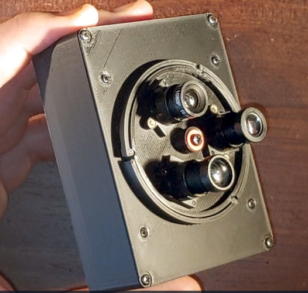

# A 3 lens M12 turret camera using a Raspberry Pi Zero

This is a compact camera using a Raspberry Pi Zero and a Pimoroni Display HAT Mini. It has a 3-lens M12 turret mount.

## You Will Need

If you want to build this from the SCAD file, you will need [my M12 turret mount library](https://github.com/JennyList/m12-turret-camera) and [my parametric project box library](https://github.com/JennyList/Jennys-rectangular-project-box).

If you merely want to print the STLs, you'll need **pi-zero-M12-camera.stl** from this repository, with **turret.stl** and **pi-zero-90-degree-module-holder.stl** from [my M12 turret mount library](https://github.com/JennyList/m12-turret-camera).

You will also need a Pi Zero with a camera module interface, [a Pimoroni Diaplay HAT Mini](https://shop.pimoroni.com/products/display-hat-mini,, three M12 lens holders with lenses, and a pinhole-type Raspberry Pi camera module. This last part is not the official Raspberry Pi camera module with a PCB, instead it's the type you can find on AliExpress or similar that comes on a flexible PCB ribbon cable. The instructions for removing the pinhole lens are in the turret camera repository.

## Assembly

You'll find instructions for assembling the camera sensor and turret in [my M12 turret mount library](https://github.com/JennyList/m12-turret-camera) repository. Assemble the front of the camera, but do not attach the Raspberry Pi. You should end up witht he front assembly with the camera flexible PCB cable poking from the back of it.

The rear assembly is the "box" with a cut-out for the Pimoroni display. First screw the four stand-offs you've just 3D printed, to the upper side of the Pi, with small self-taping screws. Then fit the Display HAT Mini to the Pi. You can then fit it to the box witht he Display HAT Mini in its opening, and attach it to the box with four more small screws. Make sure the Pi connectors face towards the opening in the box.

Connect the camera cable tot he Pi, and fit the turret assembly to the box with four more small screws.

## In Use

This camera does not have a battery. It's an experimental device, you will have to power it from a USB power supply or battery pack.

**pi-snapshot-camera.py** is a Python script to run the camera. It's slow and not very good at all, I am not the world's best coder, but it works. You can either set it to run on startup, or hook up a terminal and run it by hand.

- Button X is the shutter
- Button A leaves the Python script
- Button B shuts down the Pi

Focusing has to be done with care, particularly on the longer lenses. You may need to remove the IR filter in your M12 lens holder to give enough focusing space.

## Credits

Jenny List 2025
CC-BY-SA 4.0
